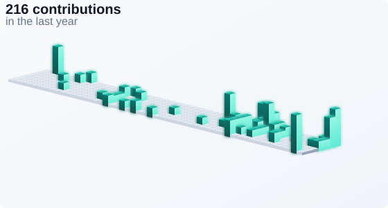

# Preston (Canyang) Zhao

Portfolio: [canyang25.github.io](https://prestonzhao.me/) · [Resume](https://canyang25.github.io/resume.pdf)

**Data science master's student @ UW–Madison** · B.S. May 2026, M.S. expected Dec 2027 · Software engineering candidate · Open to relocate

I build software, data, and AI/ML systems: production web platforms and job queues, data pipelines and ranking models, and tool-calling LLM agents.

Seeking Summer 2027 internships in software, data, or AI/ML.

**Projects**
- [Mini-MapReduce](https://github.com/canyang25/mapreduce-project) — Python MapReduce runtime with gRPC, Docker, and HDFS
- [BadgerForge](https://github.com/canyang25/BadgerForge) — LangGraph coding agent for open-weight models
- [NASA APOD Service](https://github.com/canyang25/NASA-apod-service) — Express service for NASA's Astronomy Picture of the Day
- [AutoSRE](https://github.com/canyang25/AutoSRE) — tool-calling agent from a production alert to a fix

  
  
  
  

<picture>
  <source media="(prefers-color-scheme: dark)" srcset="./output/github-contribution-grid-snake-dark.svg" />
  <source media="(prefers-color-scheme: light)" srcset="./output/github-contribution-grid-snake.svg" />
  
</picture>

**About Me**  
Data science master's student at UW–Madison, building software, data, and AI/ML systems. Software engineering candidate, open to relocate.  
Bio-Techne — software development intern. Azure TypeScript app and Python API for 50+ scientists, a Celery + PostgreSQL + Docker job service, and an XGBoost ranker trained in Databricks and served on Azure.  
AI Rudder — LLM engineer intern. Llama 3.1 8B LoRA fine-tune for tool calling, 150K+ validated conversations, and an LLM judge checked against human review.  
Turning Green — data analyst intern. Airbyte-to-Snowflake ELT, location reconciliation, and an XGBoost model ranking farm-to-school hubs.  
Looking for: Summer 2027 internships in software, data, or AI/ML.  
Contact: [canyang.zhao2@gmail.com](mailto:canyang.zhao2@gmail.com)

**Stack**  
 Python · TypeScript · JavaScript · SQL  
 FastAPI · Express · PostgreSQL · Celery  
 React · TypeScript · Tailwind · Vite  
 Docker · Azure · Databricks · Snowflake  
 LangGraph · LangChain · XGBoost · scikit-learn

 

---

Building software, data, and AI/ML systems.

